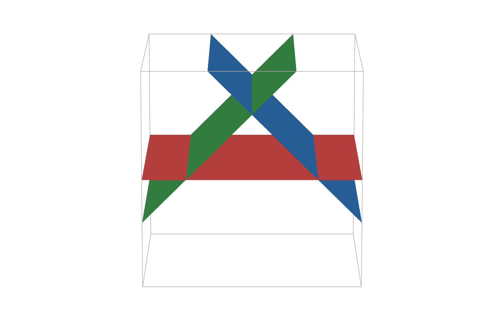
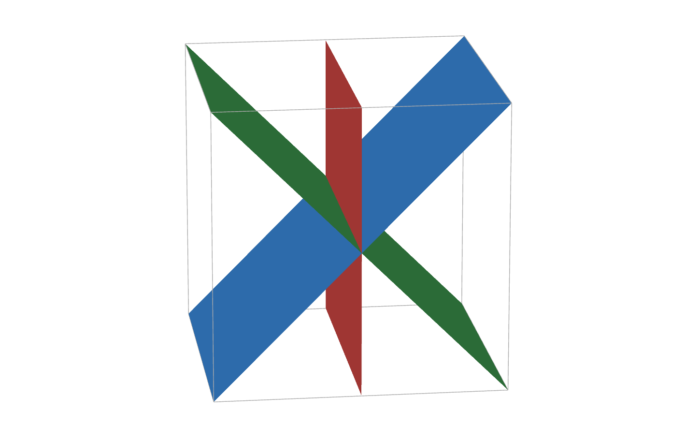
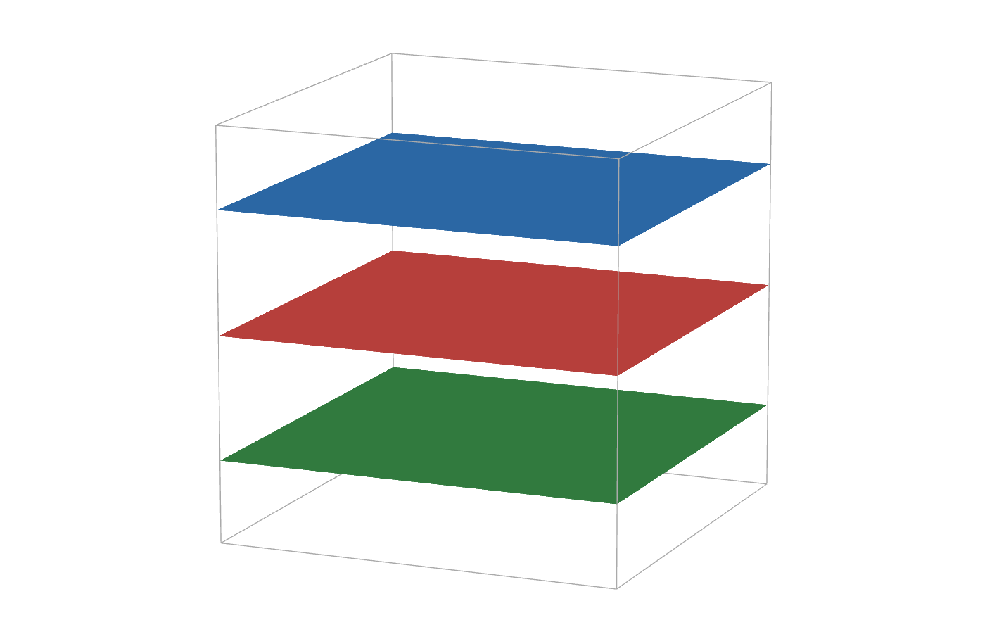
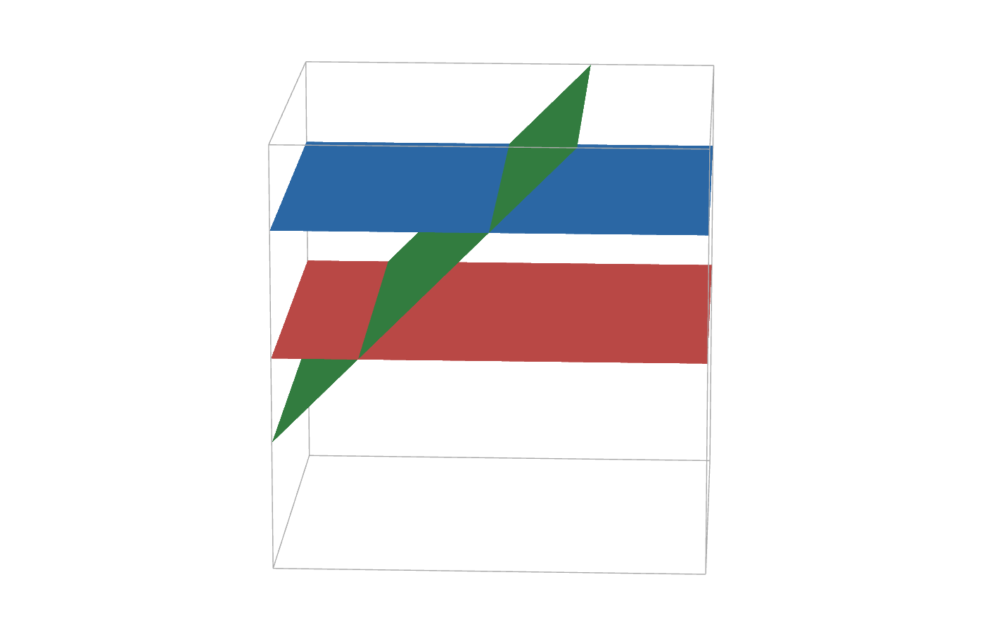
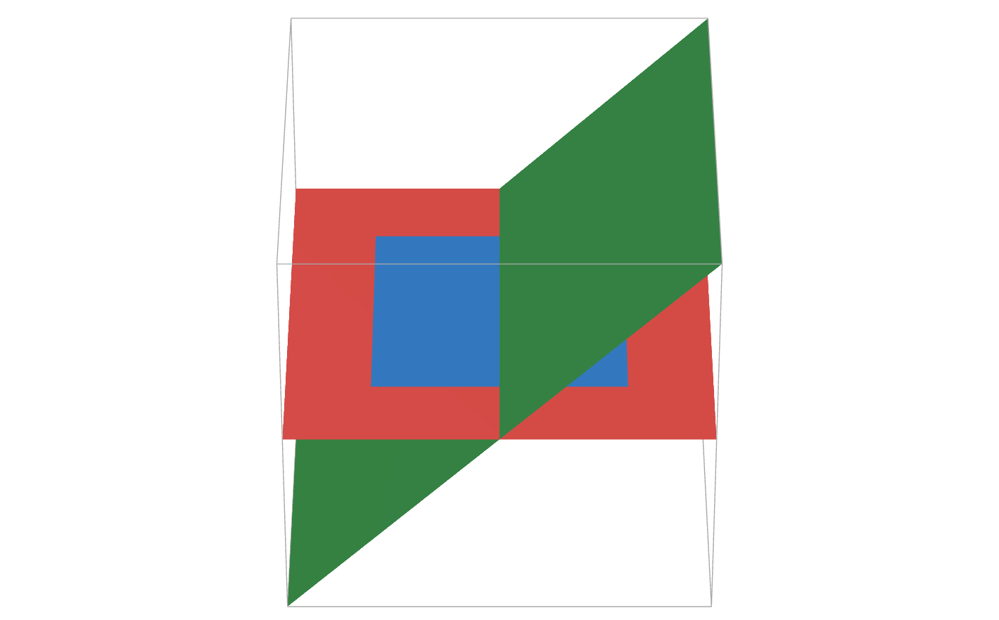
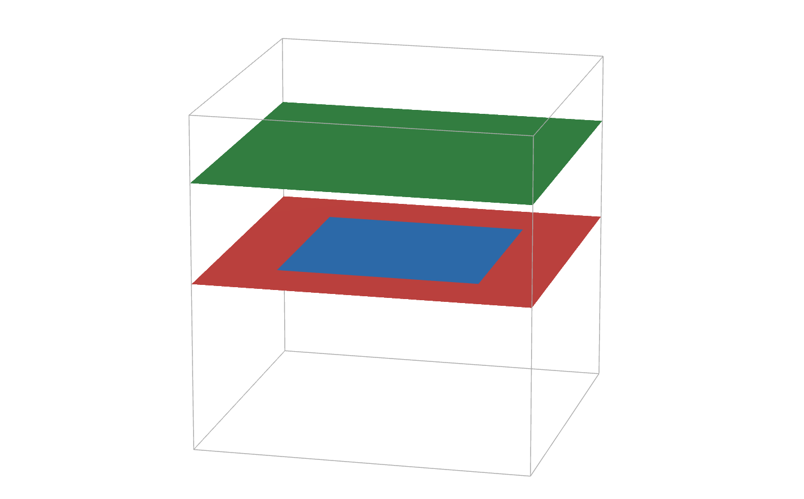

# MATH UTILS

This is a set of tools that allow to check or utilise individual math-related operations. It mainly covers "medium" 12th grade topics such as matrices or geometry (inluding vector theory) but it is planned to include other aspects in the future.

## Table of Contents
- [USAGE](#usage)
- [MATRICES](#matrices)
  - [Product (Multiplication)](#product-multiplication)
  - [Determinant](#determinant)
  - [Rank](#rank)
  - [Adjugate (conjugate)](#adjugate-conjugate)
  - [Encoding](#encoding)
  - [Decoding](#decoding)
  - [Using variables](#using-variables)
- [GEOMETRY](#geometry)
  - [VECTORS](#vectors)
    - [Dot Product](#dot-product)
    - [Cross product](#cross-product)
  - [ANALIYTIC GEOMETRY](#analytic-geometry)
    - [Relative positions](#relative-positions)
      - [3 Planes](#3-planes)
    - [Distances](#distances)
    - [Angles](#angles)
    - [Symmetric points](#symmetric-points)
- [DEVELOPMENT](#development)

## Usage
The program is divided into modules that cover each topic. Currently, [**Matrices**](#matrices) and [**Geometry**](#geometry) modules are included. When the main program is run, you will be prompted to choose from several options, and so on until reaching a specific utility. Specifics to each module are specified both in the program and in the module's README.

## Matrices

Matrix utils allow you to calculate the product of two matrices, the adjugate/conjugate matrix, the determinant and encode a message using matrices.

The encoding function only allows uppercase letters and spaces for now.
Matrices should be introduced in a special way. Columns must be separated with single slashes `/` and rows with double slashes `//`. Also, multiple matrices are separated from each other with spaces  `" "`

### Product (Multiplication)
You enter the first matrix, hit `Enter ⏎` and then the second matrix.

For example, if I wanted to enter the matrix $`\begin{pmatrix} 1 & -2 & 1\\0 & -3 & 4\\2 & 1 & -1 \end{pmatrix}`$ I would have to type it like this: `1/-2/1//0/-3/4//2/1/-1` 
and then enter the second matrix $`\begin{pmatrix} 2 & -1 & 1\\3 & 0 & -2\\-1 & 4 & 3 \end{pmatrix}`$ which would turn into `2/-1/1//3/0/-2//-1/4/3`.

The result would then be: $`\begin{pmatrix} -5 & 3 & 8\\-13 & 16 & 18\\8 & -6 & -3 \end{pmatrix}`$

### Determinant
You enter the matrix you want to calculate the determinant of, for example $`\begin{vmatrix} 1 & -2 & 1\\0 & -3 & 4\\2 & 1 & -1 \end{vmatrix}`$,
which you would type as `1/-2/1//0/-3/4//2/1/-1`.

The output is the result: `-11`

### Rank
To calculate the rank of any matrix, just enter it, for example: $`\begin{pmatrix} 1 & -2 & 1 & 3\\0 & -3 & 4 & 1\\2 & 1 & -1 & 0 \end{pmatrix}`$ in the program like so: `1/-2/1/3//0/-3/4/1//2/1/-1/0`.

The program will then print the rank of the given matrix: `3`

### Adjugate (conjugate)
To calculate de adjugate you type the matrix you want, for example this one: $`\begin{pmatrix} 1 & -2 & 1\\0 & -3 & 4\\2 & 1 & -1 \end{pmatrix}`$
in the form: `1/-2/1//0/-3/4//2/1/-1`.

Result: 
$`\begin{pmatrix} -1 & 8 & 6\\-1 & -3 & -5\\-5 & -4 & -3 \end{pmatrix}`$

### Encoding
You must provide 2 inputs: the **message** and the **encoding matrix**. The message must be in all CAPS and cannot contain any special characters (`,.;:?'"-_+=!@#$%^&*()~|\\[]{}<>/` or accents) nor numbers. For example: `I LOVE PYTHON`

After, choose an encoding matrix. **IT MUST BE SQUARE**, or it won't work. For example

$`\begin{pmatrix}
1 & 2 & 3\\
4 & 5 & 6\\
7 & 8 & 9
\end{pmatrix}`$

When we plug it into the program, it looks like this `1/2/3//4/5/6//7/8/9`. Then the program gives the matrix or matrices containing the encoded message:
$`\begin{pmatrix}
45 & 74 & 107\\
108 & 200 & 230\\
171 & 326 & 353
\end{pmatrix}
\begin{pmatrix}
81 & 14 & 0\\
210 & 56 & 0\\
339 & 98 & 0
\end{pmatrix}`$

### Decoding
To decode a message we need 2 inputs again: the matrix/matrices of the **encoded message** and the **encoding matrix**.

First you must input the matrices that form the encoded message, just like when encoding. However, to separate between matrices you must separate them with a space `' '`.

Therefore, the matrices 

$`\begin{pmatrix}
45 & 74 & 107\\
108 & 200 & 230\\
171 & 326 & 353
\end{pmatrix}
\begin{pmatrix}
81 & 14 & 0\\
210 & 56 & 0\\
339 & 98 & 0
\end{pmatrix}`$

would be introduced into the program like this: `45/74/107//108/200/230//171/326/353 81/14/0//210/56/0//339/98/0`. After, you input the encoding matrix `1/2/3//4/5/6//7/8/9` and it gives us the original message `I LOVE PYTHON`

### Using variables
When entering matrices for any operation you can also include variables or expressions, just not divisions (as / is used for element separation, but it will be changed in the future). For example, a matrix can look like `5/m-7//k-4/6` and it will be computed symbolically

## Geometry
This module covers most aspects related to geometry, such as vectors an 3D analytic geometry itself.

### Vectors
There is a utility for pure vector calculations. It currently has vector **dot** ($`\vec{u} \cdot \vec{v}`$) and **crossed** ($`\vec{u} \wedge \vec{v}`$) product. When $`\vec{u} = (2,-1,3)`$ it will be introduced in the tool as `(2,-1,3)`.

For example, having $`\vec{u} = (2,-1,0)`$ and $`\vec{v} = (1,1,-2)`$, we can **store** those vectors assigning them to a variable (`u = (2,-1,0)` and `v = (1,1,-2)`)
#### Dot Product
To get the dot product of $`\vec{u}`$ and $`\vec{v}`$ ($`\vec{u} \cdot \vec{v}`$) you just need to type in `u*v` or `u·v`. Raw vectors are also accepted `(2,-1,0)*(1,1,-2)`
#### Cross product
Cross product works in a similar way, but only wedge (^) is allowed, so to get the cross product you type `u^v` or `(2,-1,0)^(1,1,-2)`

### Analytic Geometry
Math Utils can also work with geometric entities, such as points, lines and planes. To define a point, input the name of the point followed by its coordinates: `A(0,2,1)`

To define a plane, you must use its implicit equation and the equation must be preceded with a colon `:`. `pi: -2x+y-z=0`

A line is defined the same way, but 2 equations are needed: `r: 3x-y+z-1=0,y+z=-2`

To perform any operation any geometric entities involved **must be defined first**, unlike with vectors.

#### Relative positions
Possible positions are:

| | Points | Line | Plane |
:-: |:-: | :-: | :-:
|Point| Alligned, coplanar or none | Point in Line or not | Point in Plane or not
|Line|❌|Concurrent, parallel, secant or they cross|Line in Plane, parallel or secant
|Plane|❌|Line in Plane, parallel or secant|(2 planes) Concurrent, parallel or secant

##### 3 Planes
3 planes have a total of 8 possible relative positions, which are described below:
<table>
    <thead>
        <tr>
            <th style="text-align:center"></th>
            <th style="text-align:center">RgA = RgA* = 3</th>
            <th style="text-align:center">RgA = 2, RgA* = 3</th>
            <th style="text-align:center">RgA = RgA* = 2</th>
            <th style="text-align:center">RgA = 1, RgA* = 2</th>
            <th style="text-align:center">RgA = RgA* = 1</th>
        </tr>
    </thead>
    <tbody>
    <tr>
        <td style="text-align:center">No coincident planes</td>
        <td rowspan=2></td>
        <td></td>
        <td></td>
        <td></td>
        <td rowspan=2></td>
    </tr>
        <td style="text-align:center">There are coincident planes</td>
        <td></td>
        <td></td>
        <td></td>
    <tr>
    </tr>
    </tbody>
</table>

#### Distances
To get the distance between 2 elements you just type `d element1,element2` and you will get the distance and, if it is not a number by itself, it will be also expressed numerically. For example, `d r,pi` returns $`3`$ and `d P,r` gives back $`\sqrt{2}\hspace{2mm}(1.414213)`$

#### Angles
Angles between 2 elements is requested with `< r,pi` and it will be given in **radians**. **Only lines and planes** can be introduced, and any point will give an error.

#### Symmetric points
A symmetric point with respect to a line or plane can be obtained through `sim P,r`, being `P` a **Point** and `r` a **Line or Plane**. It will return the symmetric point's three coordinates: `(-2,0,-3)`

## Development
Math Utils uses SymPy as backend processor, so **Python>=3.9** and `sympy>=1.14` is needed. It might also work with previous versions but it has not been tested.

To build it, install the `build` package with `pip install --upgrade build`, enter the repository folder and run `python -m build .` to generate a source dist and wheel.