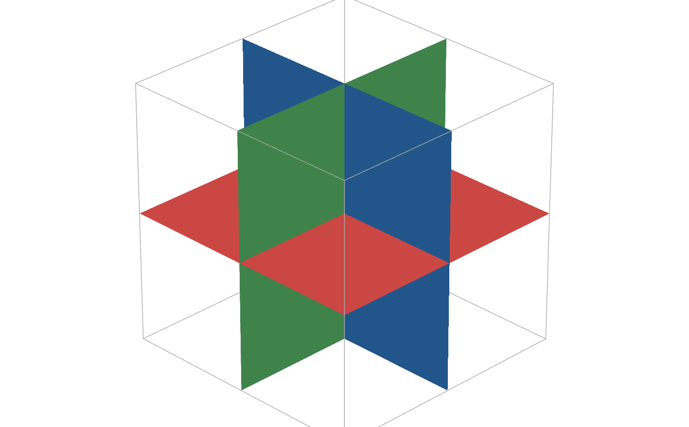
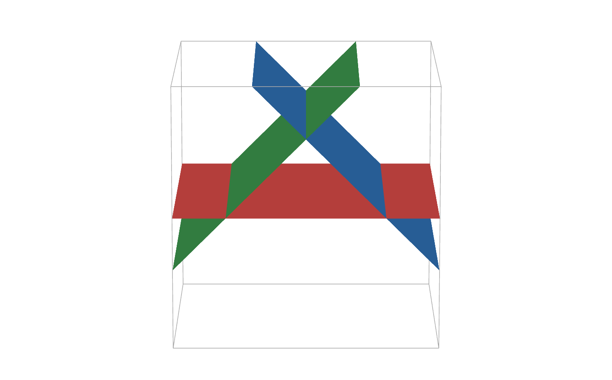
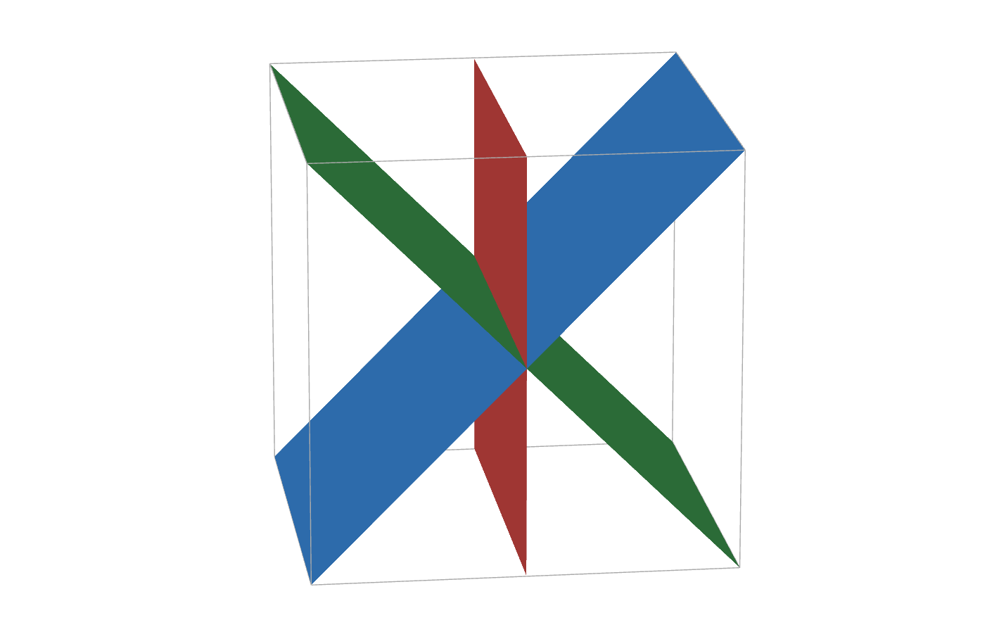
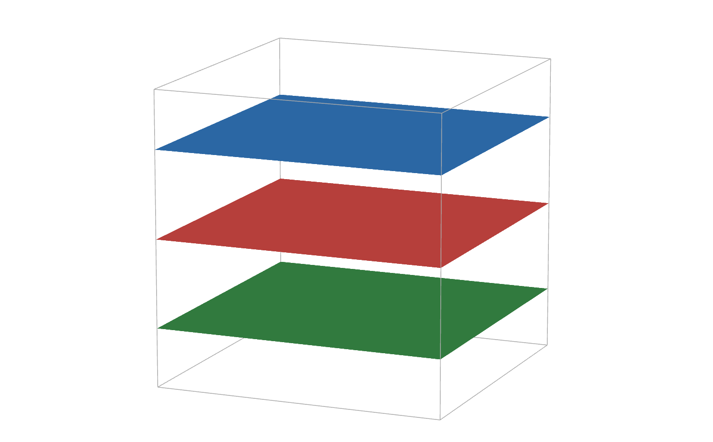
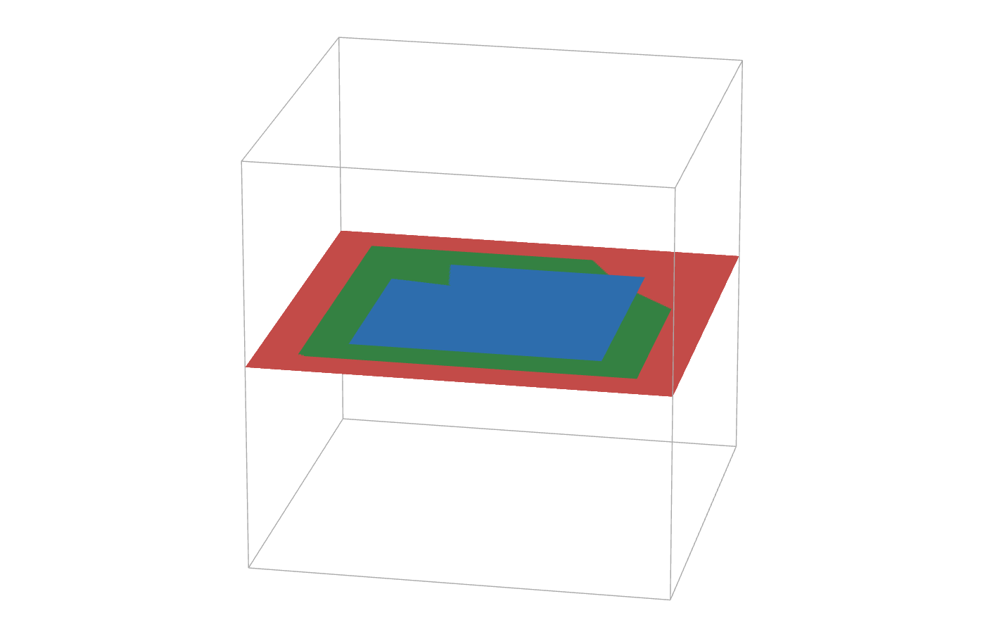
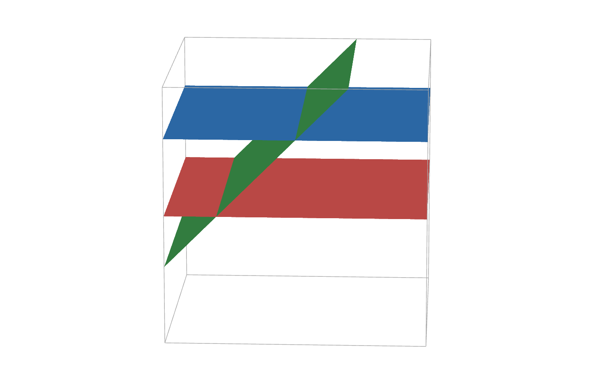
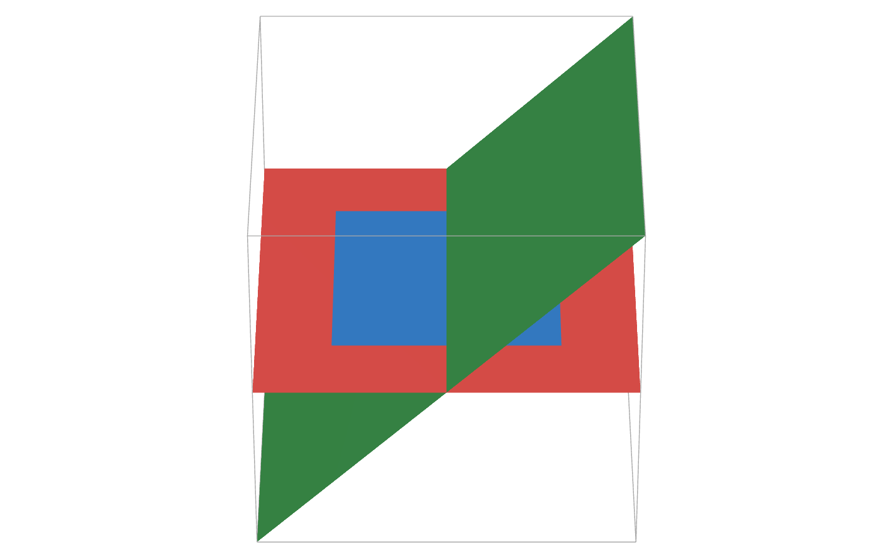
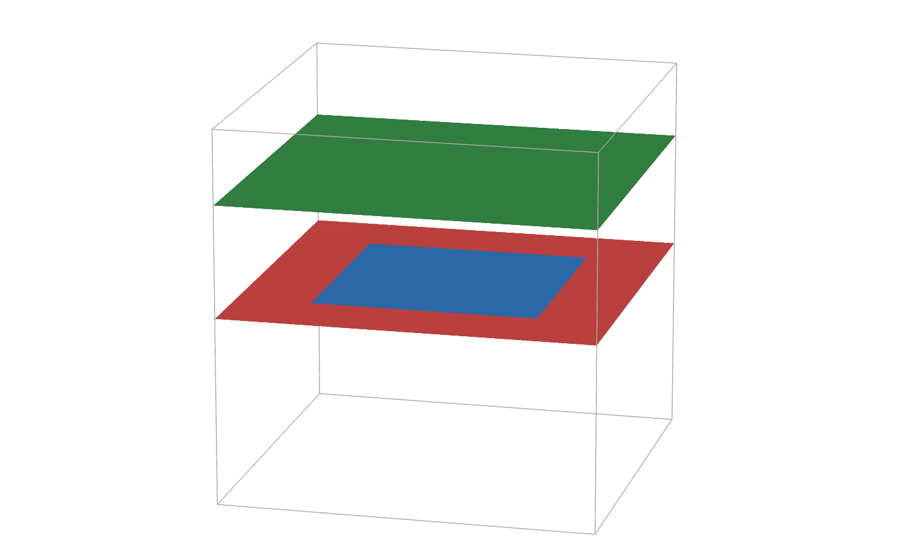

# MATH UTILS


This is a set of tools that allow to check or utilise individual math-related operations. It mainly covers "medium" 12th grade topics such as matrices or geometry (inluding vector theory) but it is planned to include other aspects in the future.

## Table of Contents
- [USAGE](#usage)
- [MATRICES](#matrices)
  - [Notation](#notation)
  - [Usage](#usage-1)
  - [Encoding](#encoding)
  - [Decoding](#decoding)
- [GEOMETRY](#geometry)
  - [VECTORS](#vectors)
    - [Dot Product](#dot-product)
    - [Cross product](#cross-product)
  - [ANALIYTIC GEOMETRY](#analytic-geometry)
    - [Relative positions](#relative-positions)
      - [3 Planes](#3-planes)
    - [Distances](#distances)
    - [Angles](#angles)
    - [Symmetric points](#symmetric-points)
- [DEVELOPMENT](#development)


## Usage
The program is divided into modules that cover each topic. Currently, [**Matrices**](#matrices) and [**Geometry**](#geometry) modules are included. When the main program is run, you will be prompted to choose from several options, and so on until reaching a specific utility. Specifics to each module are specified both in the program and in the module's README.

## Matrices

This tool is a console that lets you work with matrices in different ways. Supported operations are addition, subtraction, multiplication, adjugates, powers, determinants and ranks. A message encoder and decoder is also available.

Remember to follow the rules of matrices whe using this tool. Any illegal expression will throw an error.

### Notation

Matrices should be introduced in a special way. First, the dimensions must be introduced: `2x3`, and then the elements of the matrix `(1 2 3 4 5 6)`, so that the final result is `2x3(1 2 3 4 5 6)`
- For *addition* and *subtraction* use conventional notation (A+B and A-B)
- For *multiplication*, use A<b> * </b>B
- For *powers* ( A<sup>n</sup> ), use A<b>**</b>n or A^n
- For *determinants*, use either |A| or **det** A
- For *ranks*, use either **rg** A | **rango** A | **rank** A
- For *adjugates*, use **adj** A

There are also references to special kinds of matrices, such as zero and identity matrices. 

For **zero matrices**, you can enter `Onxm` or `On`, where *n* are the rows and *m* the columns. For example, `O3x4` would return a 3x4 zero matrix and `O3` would give us a 3x3 zero matrix. 
```python
>> O3x4

⎡0  0  0  0⎤
⎢          ⎥
⎢0  0  0  0⎥
⎢          ⎥
⎣0  0  0  0⎦
```

For **identity matrices**, the notation is `In`, where *n* is the order of the matrix. `I3`, e.g., would return a 3x3 identity matrix.
```python
>> I3

⎡1  0  0⎤
⎢       ⎥
⎢0  1  0⎥
⎢       ⎥
⎣0  0  1⎦
```

**NOTE**: If a matrix is square it can be introduced as a single number. For example `2(1 2 3 4)` is the same as entering `2x2(1 2 3 4)`

<ins>**IMPORTANT**</ins>: It is **not** possible to divide a matrix by **another matrix**, but **it is** by a **number**. 

**Variables and expressions** can also be used as matrix elements: `2x3(-1 3 -x 0 3y+4 2)` and they will be computed algebraically.

### Usage

With this, any operation can be done by entering the matrix directly or by assigning any of them previously to a variable. e.g.:
```python
3(1 -2 1 0 -3 4 2 1 -1) * 3(2 -1 1 3 0 -2 -1 4 3)
``` 
is the same as
```python
A = 3(1 -2 1 0 -3 4 2 1 -1)
B = 3(2 -1 1 3 0 -2 -1 4 3)
A * B
```
 and any combination of them. These expressions will return their corresponding results. This one, for example, would return
 ```
 
⎡-5   3   8 ⎤
⎢           ⎥
⎢-13  16  18⎥
⎢           ⎥
⎣ 8   -6  -3⎦
 ```

To access the message encoder/decoder, enter the special command `codec`.

### Encoding
You must provide 2 inputs: the **message** and the **encoding matrix**. The message must be in all CAPS and cannot contain any special characters (`,.;:?'"-_+=!@#$%^&*()~|\\[]{}<>/` or accents) nor numbers. For example: `I LOVE MATH`

After, choose an encoding matrix. **IT MUST BE SQUARE**, or it won't work. For example

$`\begin{pmatrix}
1 & 1 & 0\\
0 & 2 & 2\\
3 & 0 & 3
\end{pmatrix}`$

When we plug it into the program, it looks like this `3(1 1 0 0 2 2 3 0 3)`. Then the program gives the matrix or matrices containing the encoded message:

$`\begin{pmatrix}
9 & 37 & 13\\
24 & 54 & 28\\
63 & 60 & 3
\end{pmatrix}
\begin{pmatrix}
28 & 0 & 0\\
16 & 0 & 0\\
60 & 0 & 0
\end{pmatrix}`$

**NOTE**: The encoding function only allows uppercase letters and spaces for now.


### Decoding
To decode a message we need 2 inputs again: the matrix/matrices of the **encoded message** and the **encoding matrix**.

First you must input the matrices that form the encoded message, just like when encoding. However, to separate between matrices you must separate them with a space `' '`.

Therefore, the matrices 

$`\begin{pmatrix}
9 & 37 & 13\\
24 & 54 & 28\\
63 & 60 & 3
\end{pmatrix}
\begin{pmatrix}
28 & 0 & 0\\
16 & 0 & 0\\
60 & 0 & 0
\end{pmatrix}`$

would be introduced into the program like this: `3(9 37 13 24 54 28 63 60 3) 3(28 0 0 16 0 0 60 0 0)`. After, you input the encoding matrix `3(1 1 0 0 2 2 3 0 3)` and it gives us the original message `I LOVE MATH`


## Geometry
This module covers most aspects related to geometry, such as vectors an 3D analytic geometry itself.

### Vectors
There is a utility for pure vector calculations. It currently has vector **dot** ($`\vec{u}`$ · $`\vec{v}`$) and **crossed** ($`\vec{u}`$ $`\wedge`$ $`\vec{v}`$) product. When $`\vec{u}`$ = $`(2,-1,3)`$ it will be introduced in the tool as `(2,-1,3)`.

For example, having $`\vec{u}`$ = $`(2,-1,0)`$ and $`\vec{v}`$ = $`(1,1,-2)`$, we can **store** those vectors assigning them to a variable (`u = (2,-1,0)` and `v = (1,1,-2)`)
#### <ins>Dot Product</ins>
To get the dot product of $`\vec{u}`$ and $`\vec{v}`$ ($`\vec{u}`$ · $`\vec{v}`$) you just need to type in `u*v`, like a regular multiplication. Raw vectors are also accepted `(2,-1,0)*(1,1,-2)`
#### <ins>Cross product</ins>
Cross product works in a similar way, but only wedge (^) is allowed, so to get the cross product you type `u^v` or `(2,-1,0)^(1,1,-2)`

### Analytic Geometry
Math Utils can also work with geometric entities, such as points, lines and planes. To define a point, input the name of the point followed by its coordinates: `P(0,2,1)`

To define a plane, you must use its implicit equation and the equation must be preceded with a colon `:`. `pi: -2x+y-z=0`

A line is defined the same way, but 2 equations are needed: `r: 3x-y+z-1=0,y+z=-2`

To perform any operation any geometric entities involved **must be defined first**, unlike with vectors.

#### <ins>Relative positions</ins>
You can also determine the relative position between geometric objects. To do that, you need to enter the `relpos` command, separating the elements to be compared separated just with commas. For example: `relpos r,pi`.

**IMPORTANT**: You can only calculate the relative position between **2 objects**. <ins>Exceptions</ins>: You can calculate the relative position of an **indefinite** number of **points** and of **up to 3 planes**.

Possible positions are:

| | Points | Line | Plane |
:-: |:-: | :-: | :-:
|Point| Alligned, coplanar or none | Point in Line or not | Point in Plane or not
|Line|Point in Line or not|Concurrent, parallel, secant or they cross|Line in Plane, parallel or secant
|Plane|Point in Plane or not|Line in Plane, parallel or secant|(2 planes) Concurrent, parallel or secant

##### **3 Planes**
3 planes have a total of 8 possible relative positions, which are described below:
<table>
    <thead>
        <tr>
            <th style="text-align:center"></th>
            <th style="text-align:center">RgA = RgA* = 3</th>
            <th style="text-align:center">RgA = 2, RgA* = 3</th>
            <th style="text-align:center">RgA = RgA* = 2</th>
            <th style="text-align:center">RgA = 1, RgA* = 2</th>
            <th style="text-align:center">RgA = RgA* = 1</th>
        </tr>
    </thead>
    <tbody>
    <tr>
        <td style="text-align:center">No coincident planes</td>
        <td rowspan=2></td>
        <td></td>
        <td></td>
        <td></td>
        <td rowspan=2></td>
    </tr>
        <td style="text-align:center">There are coincident planes</td>
        <td></td>
        <td></td>
        <td></td>
    <tr>
    </tr>
    </tbody>
</table>

#### <ins>Distances</ins>
To get the distance between 2 elements you just type `d element1,element2` and you will get the distance and, if it is not a number by itself, it will be also expressed numerically. For example, `d r,pi` returns $`3`$ and `d P,r` gives back $`\sqrt{2}\hspace{2mm}(1.414213)`$

#### <ins>Angles</ins>
Angles between 2 elements is requested with `< r,pi` and it will be given in **radians**. **Only lines and planes** can be introduced, and any point will give an error.

#### <ins>Symmetric points</ins>
A symmetric point with respect to a line or plane can be obtained through `sim P,r`, being `P` a **Point** and `r` a **Line or Plane**. It will return the symmetric point's three coordinates: `(-2,0,-3)`

## Development
Math Utils uses SymPy as backend processor, so **Python>=3.9** and `sympy>=1.14` is needed. It might also work with previous versions but it has not been tested.

To build it, install the `build` package with `pip install --upgrade build`, enter the repository folder and run `python -m build .` to generate a source dist and wheel.
