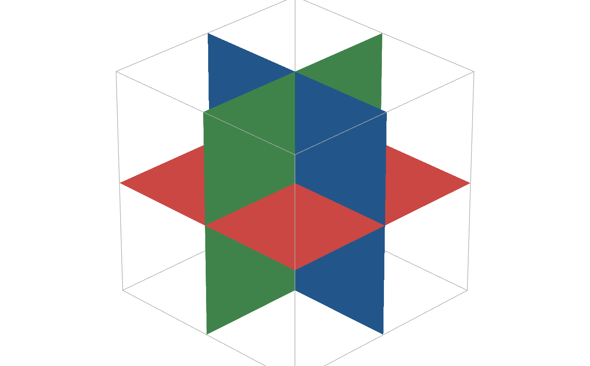
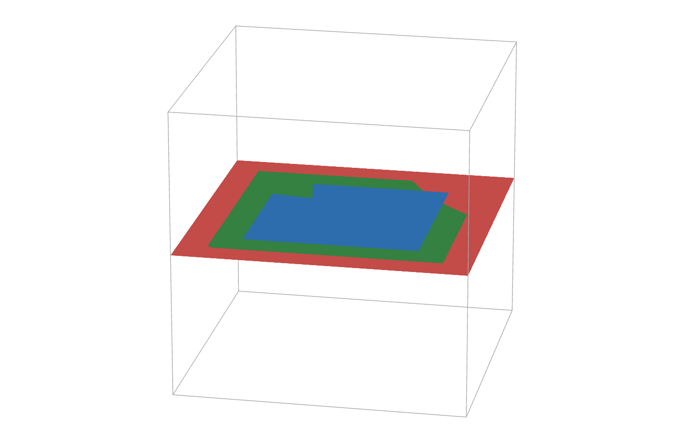

# Geometry
This module covers most aspects related to geometry, such as vectors an 3D analytic geometry itself.

## Vectors
There is a utility for pure vector calculations. It currently has vector **dot** ($`\vec{u} \cdot \vec{v}`$) and **crossed** ($`\vec{u} \wedge \vec{v}`$) product. When $`\vec{u} = (2,-1,3)`$ it will be introduced in the tool as `(2,-1,3)`.

For example, having $`\vec{u} = (2,-1,0)`$ and $`\vec{v} = (1,1,-2)`$, we can **store** those vectors assigning them to a variable (`u = (2,-1,0)` and `v = (1,1,-2)`)
### Dot Product
To get the dot product of $`\vec{u}`$ and $`\vec{v}`$ ($`\vec{u} \cdot \vec{v}`$) you just need to type in `u*v` or `u·v`. Raw vectors are also accepted `(2,-1,0)*(1,1,-2)`
### Cross product
Cross product works in a similar way, but only wedge (^) is allowed, so to get the cross product you type `u^v` or `(2,-1,0)^(1,1,-2)`

## Geometry
Math Utils can also work with geometric entities, such as points, lines and planes. To define a point, input the name of the point followed by its coordinates: `A(0,2,1)`

To define a plane, you must use its implicit equation and the equation must be preceded with a colon `:`. `pi: -2x+y-z=0`

A line is defined the same way, but 2 equations are needed: `r: 3x-y+z-1=0,y+z=-2`

### Relative positions
To get the relative position of two elements they must be defined first. The possible positions are:

| | Points | Line | Plane |
:-: |:-: | :-: | :-:
|Point| Alligned, coplanar or none | Point in Line or not | Point in Plane or not
|Line|❌|Concurrent, parallel, secant or they cross|Line in Plane, parallel or secant
|Plane|❌|Line in Plane, parallel or secant|(2 planes) Concurrent, parallel or secant

### 3 Planes
  